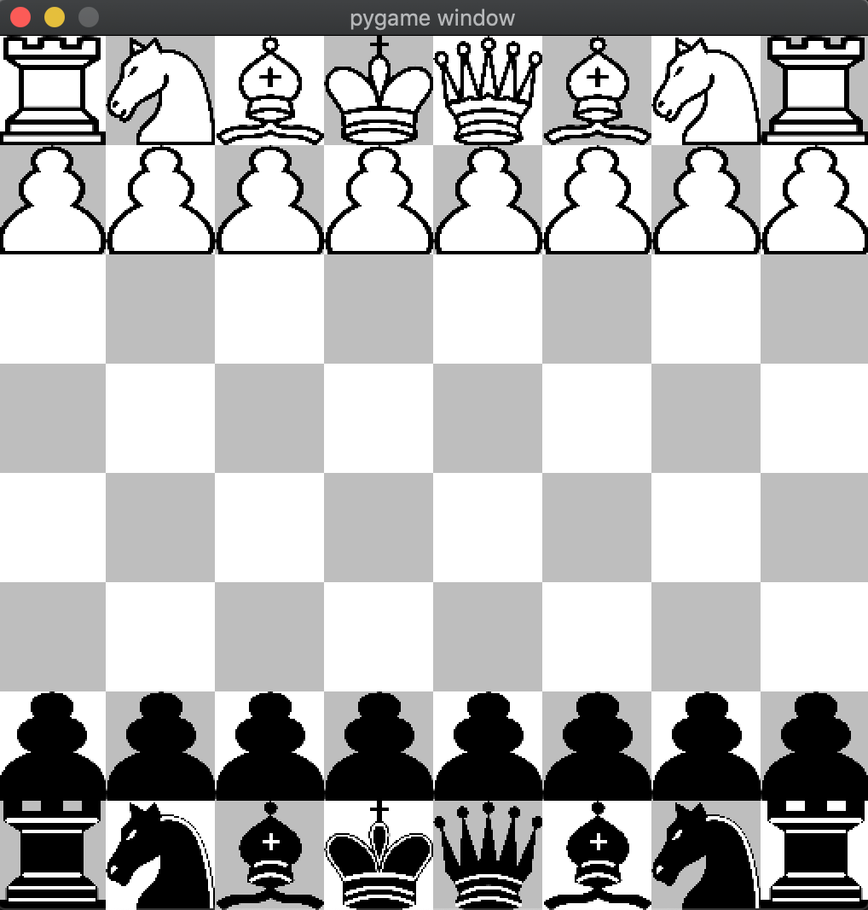

# Python Chess
A GUI chess game including a simple AI, all written in Python.
<p align="center">

</p>

## Index
1. [About](#about)
2. [Demo](#demo)
3. [Usage](#usage)
    * [Installation](#installation)
    * [Commands](#commands)


<a name="about"></a>
## About
This project includes a full chess engine, gui engine, and an AI engine. The AI engine utilizes the minimax and alpha beta pruning algorithms.

<a name="demo"></a>
## Demo
| Human vs Human   | Human vs AI (AI is controlling black)  |
|:----------------------|:------------------|
| |  |
| [First full human vs human test run]| [First full human vs AI test run] |


<a name="installation"></a>
### Installation
- Switch to Python3.
- Follow the code below to create virtual environment and install the necessary libraries.
(Currently tested on Python 3.7.9 with Pygame 2.0.0dev8 and Python 3.8.2 with Pygame 2.0.0 on macOS Catalina)
```
git clone https://github.com/attainu/python-project-akash-dagar-au16.git
cd python-chess
python3 -m venv venv
source venv/bin/activate
pip install pygame
```

<a name="commands"></a>
### Commands
- To start the game, run `python3 -W ignore chess_gui.py`, then select the game mode you want to play in the command line.
- To undo a move, press `u`.
- To reset the board, press `r`.


